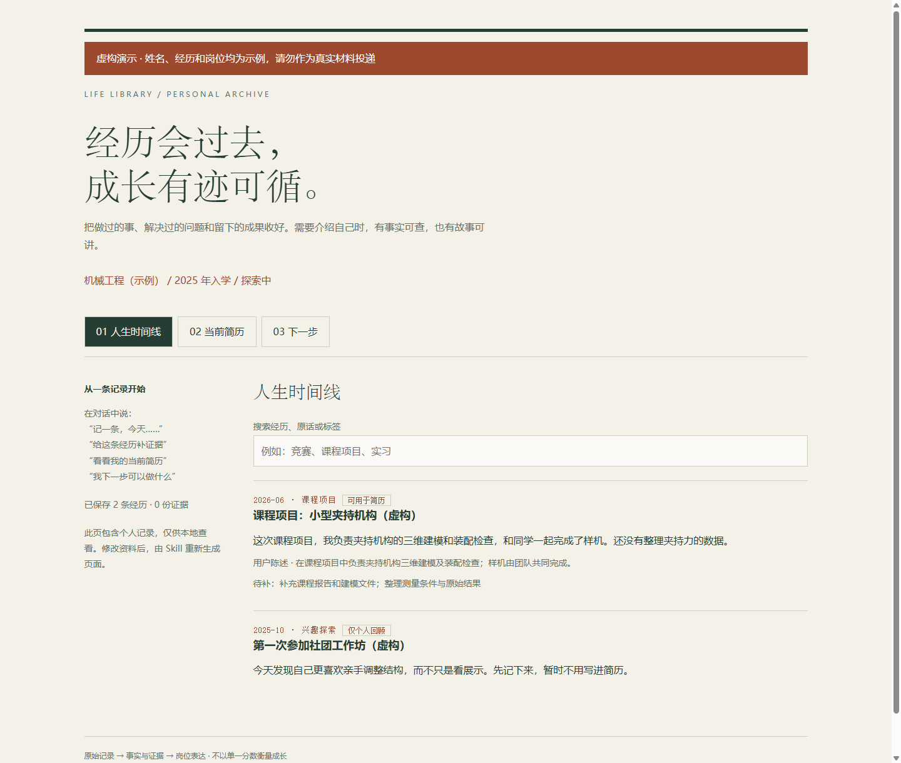

# 人生库 · Life Library

**从大学第一天开始，留住经历、成果和证据。等到写简历时，不必从记忆里拼凑自己。**

人生库是一个给 AI 助手使用的 Skill。你负责讲述，助手帮你保存原始记录、归档证据、整理可追溯的简历素材，并结合专业、兴趣和岗位资料讨论下一步。

**当前版本：v0.1.0-beta.2。** 适合愿意通过 AI 助手管理本地资料的学生。它不是独立 App，也不是打开网页就能录入的在线服务。

**[下载 WorkBuddy 技能包](https://github.com/somnus-J-307/life-library/releases/download/v0.1.0-beta.2/life-library-workbuddy.zip)** · [WorkBuddy 安装说明](docs/workbuddy.md) · [Codex 安装](#安装到-codex) · [竞品调研与定位](docs/competitive-landscape.md)

## 四句话开始

```text
用人生库记一条：今天电赛拿了省二，我负责电源部分，证书还没发。
给刚才那条经历补证据：这是证书文件。
这段经历可以用于简历，帮我看看当前简历。
我是大一学生，还不确定方向，结合我的专业和兴趣看看下一步。
```

以上是虚构使用示例，不会自动写入你的档案。说不清日期、暂时没有证书，也能先记下来；不确定的部分保留为待补项。

## 它会帮你做什么

| 入口 | 得到什么 |
| --- | --- |
| 记一条 | 原话、发生时间、个人职责、结果与待补项；保留不确定性 |
| 补证据 | 证书、报告等文件的本地副本和完整性哈希；关联同一经历 |
| 当前简历 | 经你允许的经历生成的草稿，每个要点能追溯到事实 |
| 下一步 | 根据阶段、兴趣和岗位证据提出具体行动、预期成果与验收方法 |

本地页面包含时间线、搜索、当前简历和下一步。每次助手更新资料后重新生成；已保存的简历版本不会随新草稿改变。



## 安装到 WorkBuddy

下载上面的 **WorkBuddy 专用 ZIP**，在 WorkBuddy 中打开「技能 / Skills → 添加技能 → 上传技能」，导入后确认已启用，再直接说「使用人生库，记一条……」。无需运行 Codex 安装器。入口依据 [WorkBuddy 官方说明](https://www.workbuddy.cn/docs/workbuddy/From-Beginner-to-Expert-Guide/Function-Description/Skills-Market)；本项目未上架官方技能市场。

归档和页面生成需要 WorkBuddy 能调用 Python 3.10+。已验证包结构及解压后脚本，**尚未完成 WorkBuddy 桌面端导入与对话实测**。详见[运行条件与首次使用](docs/workbuddy.md)。

供下载页面使用的[静态 JSON 接口](https://raw.githubusercontent.com/somnus-J-307/life-library/main/downloads/workbuddy.json)提供版本、下载地址和 SHA-256；它是本项目的下载信息，不是 WorkBuddy 官方 API。当前下载托管在 GitHub，尚无国内镜像。

## 安装到 Codex

需要 **Python 3.10 或更新版本**，以及能读取 Skill、操作本地文件并运行 Python 的 Codex 环境。脚本仅使用 Python 标准库，没有 pip 依赖。

1. 下载本仓库的 ZIP（页面的 **Code → Download ZIP**），或克隆仓库。
2. 解压后，在仓库目录运行：

   ```shell
   python -X utf8 tools/install.py
   ```

   安装器遵循 `CODEX_HOME`；未设置时复制到 `~/.codex/skills/life-library`。它不会覆盖已经存在的同名 Skill，也不会创建或上传个人资料。Windows 上若没有 `python` 命令，可改用 `py -3`。

3. 在下一轮对话中输入：

   ```text
   使用 $life-library。在我的个人文档目录创建人生库，先帮我记录一条经历。
   ```

如果未被发现，重开会话；也可以明确让助手读取已安装的 `life-library/SKILL.md`。不要把个人资料保存在 Skill 安装目录中，升级 Skill 时需要保留资料库。

也可以手动将本仓库的 `skills/life-library` 文件夹复制到你的 Codex skills 目录。安装到自选位置：

```shell
python -X utf8 tools/install.py --dest /absolute/path/to/skills/life-library
```

其他支持 `SKILL.md` 的助手可以手动加载该文件夹，但其自动发现机制和文件权限可能不同；当前没有声称完成跨客户端兼容验证。纯网页聊天环境如果不能持久保存和运行本地文件，无法使用完整功能。

## 第一次使用

先指定一个**不用于公开发布的个人资料目录**。你可以一次提供专业、入学年份、预计毕业年份和兴趣，也可以先记录，之后再补。系统不会根据专业把职业方向锁死。

```text
使用人生库，数据放到我的个人文档目录下的 life-library-data。
我是 2025 年入学的学生，专业是机械工程，目前对产品设计和机器人感兴趣。
先记一条：这学期完成了一个课程项目，我负责结构建模；结果数据还没整理。
```

这只是填写方式示例，请替换成自己的真实情况。资料结构如下：

```text
life-library-data/
  library.json     原始记录、事实、岗位快照和当前简历表达
  evidence/        证据副本
  index.html       包含个人记录的本地总览
  resume.md        当前简历草稿
  snapshots/      冻结版本与对应来源，仅用于私人留档
```

备份时复制整个资料目录。公开分享简历时，只选择核对过的 `resume.md` 或从简历视图打印的文件；不要分享整个资料库或 `index.html`。

## 先看看虚构演示

不用填写个人信息，在仓库目录运行：

```shell
python -X utf8 tools/demo.py --dest ./demo-output
```

打开生成的 `demo-output/index.html`，可以搜索经历、切换简历与下一步。示例姓名、经历和岗位均为虚构；演示不会覆盖现有目录，也不会混入真实资料。

## asu 和岗位需求

- **不依赖 asu 安装。** 如果你的环境已有 `asu`，人生库可以按你的简历请求使用它；没有时采用内置的事实整理和表达规则。本项目不打包、分发或自动安装第三方 Skill。
- **不内置所谓“实时 HC 数据库”。** 你提供招聘资料，或让具备联网能力的助手核验官方岗位后，才保存来源、日期和原始要求。招聘人数未公布就记为未知。
- 历史招聘信息用于观察需求；回答“现在能投什么”需要重新核验。不会把某一条 JD 变成所有学生都应遵循的培养路线。
- 当前输出是 Markdown 草稿和本地 HTML 预览；没有自动投递、Word 排版服务或后台提醒。

## 隐私与真实性

存储脚本不联网，没有账号服务或遥测。**但你使用的 AI 助手可能会把对话和读取的资料发送给其模型服务提供方**；本地保存不代表模型推理离线。请按自己的隐私要求选择运行环境，避免提供不必要的敏感材料。

记录默认仅个人回顾，经你允许后才用于简历。`private` 是用途标记，不是加密或文件访问控制。总览页面仍包含私人记录；冻结版本也可能含原话和附件。资料文件以明文保存。

原始说法、事实整理和岗位表达分开；无证据的数字不补造，团队贡献不写成个人主导。校验器能检查引用、状态、文件完整性等结构约束，**不能自动判断奖项真伪，也不能证明生成的句子完全符合事实**。投递前仍需核对每个主张。

## 开发与反馈

```shell
python -X utf8 skills/life-library/scripts/test_library.py
python -X utf8 tools/test_distribution.py
python -X utf8 tools/build.py
```

构建使用明确的文件清单，不收集你的资料、缓存或测试输出。产物在 `dist/`，包含通用安装 ZIP、仅含 Skill 的 `.skill`、WorkBuddy 专用 ZIP、下载信息 JSON 和 SHA-256 清单。`.skill` 本质是 ZIP，不承诺所有客户端都支持直接导入；WorkBuddy 用户选择 `life-library-workbuddy.zip`，Codex 用户按上面的 ZIP 安装步骤操作。

遇到问题请在 [Issues](https://github.com/somnus-J-307/life-library/issues) 说明操作、预期和实际结果，使用脱敏或虚构资料复现，勿附真实证书、身份证或完整人生库。欢迎先反馈“第一次使用卡在哪里”。

## License

[MIT](LICENSE) · Copyright (c) 2026 somnus-J-307。本项目许可不改变用户资料及其附件原有的权利归属。
